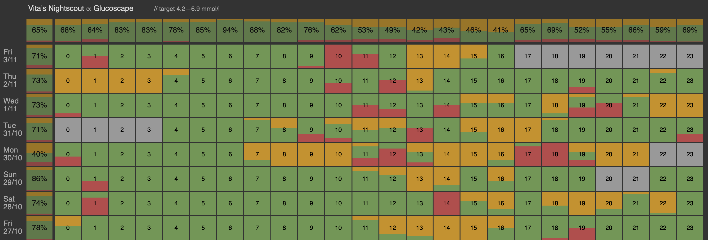

# Glucoscape

## Overview

Glucoscape is a small application that helps visualize Continuous Glucose Monitoring (CGM) data quickly and intuitively. It provides a heatmap representation of time spent below range, in range, and above range, allowing for easy identification of glucose patterns.

## Features

- Loads the last 14 days of CGM data from your own Nightscout instance.
- Uses the target range you have configured in Nightscout.
- Displays a heatmap representation of time spent below/in/above your target range for each hour of each day.
- Visually summarises time in range for each day ("what was my total time in range yesterday?")
- Visually summarises time in range for each hour of day ("what's my average time in range between 9 and 10am?")

## Getting Started

### Prerequisite: Nightscout access

To provide access to your Nightscout data, you need to check three things:

1. Find your Nightscout instance address (URL).
2. Create an **access token** which Glucoscape will use as a password when talking to Nightscout.
    - You can create a token by going to your Nightscout menu > Admin Tools > Subjects - People, Devices > Add new Subject.
    - Set `Name` to whatever you like, e.g. `glucoscape`.
    - Set `Roles` to `readable`.
3. Make sure your Nightscout instance **has CORS enabled**.
    - Add `cors` to the list of enabled plug-ins.
    - See [Nightscout docs](https://nightscout.github.io/nightscout/setup_variables/#cors-cors) for details.

### Use the app directly on GitHub

This is the simplest way to use the app. It is pre-built and hosted directly by GitHub Pages.

1. Navigate to [vitawasalreadytaken.github.io/glucoscape](https://vitawasalreadytaken.github.io/glucoscape/)
2. Fill in your Nightscout address and access token and click _Connect_
3. ⭐️ Optionally bookmark the page for easier access next time (the address will look like `https://vitawasalreadytaken.github.io/glucoscape/#session=%7B%22nightscoutUrl...`)

Your Nightscout address and access token are never saved by the app.
A simple way to keep them (and skip the _Connect_ step next time) is to bookmark the page.
Note that the address and access token will be a part of your bookmarked address.

### Build and run the app yourself

1. Clone this repository
2. `npm install`
3. `npm run build`
4. Open `build/index.html` in your browser
5. Fill in your Nightscout address and access token and click _Connect_

## See also

I have also built [Koboscout](https://github.com/vitawasalreadytaken/koboscout), an 'ambient' app showing
a chart of your latest CGM readings on an e-reader device or tablet.

## Contributing

I welcome contributions from the community. If you have suggestions, bug reports, or would like to contribute code, please open an issue or pull request here on GitHub.

## License

This project is licensed under the MIT License - see the LICENSE file for details.
